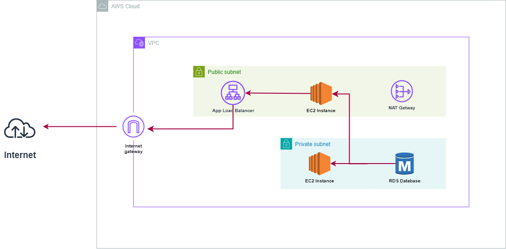

# AWS Multi-Tier Web Application Deployment

This README outlines the detailed steps followed to deploy a multi-tier web application on AWS, including EC2 instances, RDS MySQL database, and an Application Load Balancer (ALB). This project demonstrates how to configure a VPC with both public and private subnets, deploy an Apache web server on EC2, set up a database, and manage traffic using a load balancer.

## Architecture Overview

- **VPC (Virtual Private Cloud):** A VPC with a CIDR block of `11.0.0.0/16` was created.
- **Subnets:** The VPC includes two public subnets and two private subnets.
- **NAT Gateway:** Configured for internet access in the private subnets.
- **EC2 Instances:** Three EC2 instances were deployed:
  - One public instance for SSH access.
  - Two private instances running the Apache web server.
- **Application Load Balancer:** Configured to balance traffic between the two private EC2 instances.
- **RDS MySQL Database:** A MySQL database was deployed in a private subnet, accessible only from the private EC2 instances.

Here’s a visual representation of the architecture:



---

## Step-by-Step Process

### 1. VPC and Subnet Creation

- A VPC with a CIDR block of `11.0.0.0/16` was created.
- **Public Subnets:** Two public subnets were created for the public EC2 instance and NAT gateway.
- **Private Subnets:** Two private subnets were created for the private EC2 instances and RDS database.
- **Internet Gateway:** An internet gateway was attached to the VPC for public instances to communicate with the internet.
- **NAT Gateway:** A NAT gateway was created in one of the public subnets to allow the private instances to access the internet without exposing them directly.

### 2. EC2 Instances

- **Public Instance:**
  - One EC2 instance was deployed in a public subnet to allow SSH access.
  - A security group was created to allow inbound SSH and HTTP traffic to this instance.

- **Private Instances:**
  - Two EC2 instances were deployed in the private subnets.
  - The following user data script was added to automatically install and start Apache:
    ```bash
    #!/bin/bash
    yum update -y
    yum install -y httpd
    systemctl start httpd
    systemctl enable httpd
    echo "<h1>This message from: $(hostname -i)</h1>" > /var/www/html/index.html
    ```

### 3. Security Groups

- **EC2 Security Group:** A single security group was created for all EC2 instances, with the following rules:
  - Inbound rules allowing:
    - All traffic (for internal communication).
    - HTTP (port 80) for web traffic.
    - Custom TCP rule for the public IP of the public instance.
  
- **Load Balancer Security Group:** Another security group was created for the Application Load Balancer, allowing HTTP traffic from the internet.

### 4. Application Load Balancer (ALB)

- **ALB Configuration:**
  - An Application Load Balancer (ALB) was deployed to distribute traffic between the two private EC2 instances.
  - The ALB was set to internet-facing, using IPv4, and spanned across two availability zones.
  - A security group (ALB-SG) was configured for the ALB, allowing HTTP traffic on port 80.
  
- **Target Group:**
  - A target group (ALB-TG) was created to include the two private EC2 instances.
  - The health checks for the ALB were configured to verify the availability of the private instances.

### 5. RDS MySQL Database

- **Database Setup:**
  - A MySQL database was created using Amazon RDS, named `database-1`.
  - The database was configured with a port of `3306` and placed in a private subnet for security.
  - The database endpoint was `database-1.cxqqo262q0mn.eu-north-1.rds.amazonaws.com`.
  
- **Security Group for RDS:**
  - The security group for the RDS instance allowed MySQL/Aurora traffic (port 3306) from the private EC2 instances.

### 6. Connecting to EC2 Instances and Database

- **Access to Public Instance:**
  - Using SSH, I connected to the public instance with the following command:
    ```bash
    ssh -i "adminkey.pem" ec2-user@ec2-16-16-63-30.eu-north-1.compute.amazonaws.com
    ```

- **Access to Private Instances:**
  - From the public instance, I connected to one of the private instances using the internal IP address:
    ```bash
    ssh -i "adminkey.pem" ec2-user@11.0.130.110
    ```

- **Database Connectivity:**
  - From the private instance, I tested the connection to the MySQL database using `telnet`:
    ```bash
    telnet database-1.cxqqo262q0mn.eu-north-1.rds.amazonaws.com 3306
    ```


